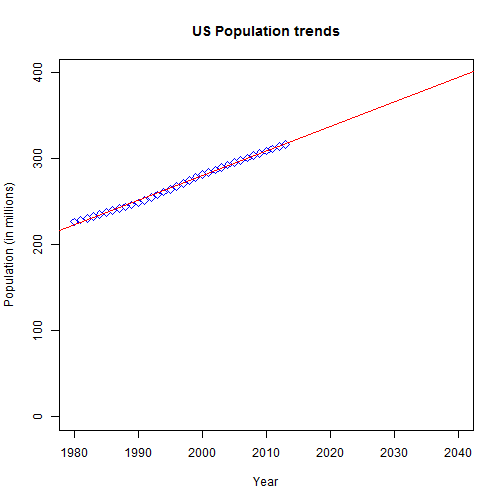

## Application Description

Git: <https://github.com/amustakim/PopulationPredictor>

The application uses R code to calculate the future US population between the years 2014 and 2040 using historical population data from the past 34 years (i.e. 1980 to 2013) and linear regression based on those past data points. It basically:

1. prompts the user to select a year between 2014 and 2040 (by default 2020 is selected)
2. then draws a scatter plot with the regression line from 1980 to 2040 and indicates future population for the selected year, right on the plot
3. it also displays the historial data in a table, on the right-hand panel

--- .class #id 

## Application Screenshot

<div style='text-align: center;'>
    
</div>

--- .class #id 

## Code Snippet (Extract & Clean Data)
The `getPop()` function in `server.R` extracts and cleans the historical data: 

```r
library(XML)
getPop <- function() {
#Get the population data from the Internet and parse it out into a data.frame called Pop, then format it's columns
        theurl <- "http://www.usgovernmentspending.com/download_multi_year_1980_2013USb_14c2li101mcn_20s"
        tables <- readHTMLTable(theurl)
        n.rows <- unlist(lapply(tables, function(t) dim(t)[1]))
        tables[[which.max(n.rows)]]
        x <- tables$"Government Spending ChartFiscal Years 1980 to 2013"
        Pop <- head(x[,c(1,3)], 34, stringsAsFactors = FALSE)
        colnames(Pop) <- c("Year","Population (in millions)")
        Pop$Year <- round(as.numeric(levels(Pop$Year))[Pop$Year])
        Pop$"Population (in millions)" <- as.numeric(levels(Pop$"Population (in millions)"))[Pop$"Population (in millions)"]
        return (Pop)
}
#Get cached data from the Internet (to save time from reloading data everytime server.R code is called)
Pop <<- getPop()
```

```
## Warning: NAs introduced by coercion
```

--- .class #id 

## Code Snippet (Draw Plot)

```r
#Render the scatterplot for 34 years worth of data from 1980 to 2013:
plot(Pop, col="blue", pch=5, main='US Population trends', ylim=c(0,400), xlim=c(1980,2040))
#Add a regression trendline
fit <- lm(Pop$"Population (in millions)"~Pop$Year)
abline(fit , col="red", lwd=1, lty=1)        
```

 
